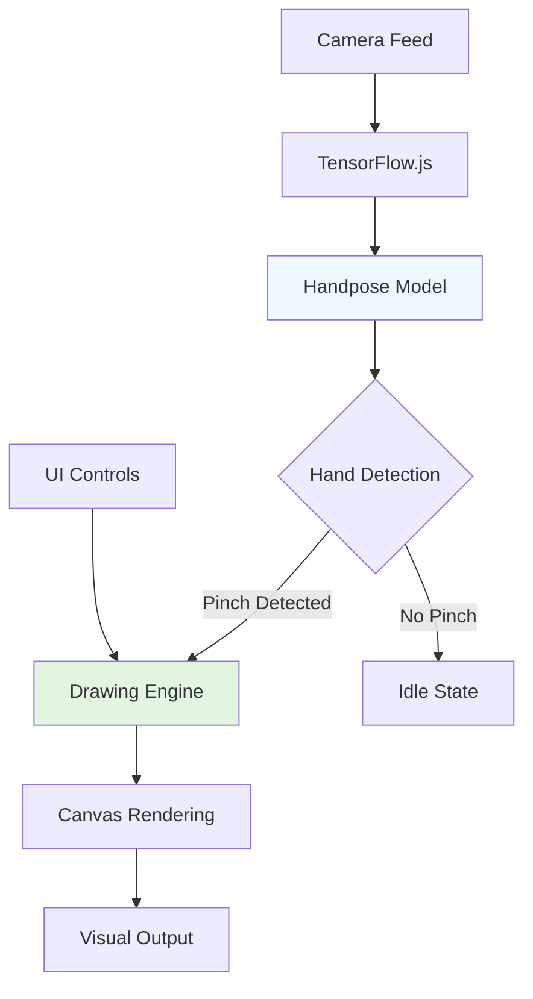

# 🎨 AR Finger Sketch ✨


> **Draw in thin air using just your fingers!** An augmented reality web application that turns your hand gestures into digital art using real-time hand tracking.

## 🌟 Features

### ✨ Magic Gestures

- **👆 Pinch-to-Draw**: Simply pinch your index finger and thumb together to start drawing in the air
- **🎨 Live Color Changing**: Tap between 7 vibrant colors instantly
- **📱 AR Mode**: Toggle between augmented reality and normal drawing modes
- **🔄 Camera Flip**: Switch between front and back cameras
- **🗑️ Canvas Control**: Clear canvas or undo your last stroke with a single tap

### 🚀 Technical Highlights

- **Real-time Hand Tracking**: Powered by TensorFlow.js Handpose model
- **No Installation**: Runs directly in modern browsers
- **Mobile-Optimized**: Touch-friendly interface with responsive design
- **Offline Capable**: PWA support for app-like experience
- **Privacy Focused**: All processing happens locally in your browser

## 🎯 Live Demo

[](https://your-deployment-link.com)

*Works best on mobile devices with good camera access!*

## 📸 Screenshots

| Drawing in AR Mode | Color Selection | Camera View |
|--------------------|-----------------|-------------|
|  |  |  |

## 🛠️ Quick Start

### Option 1: Direct Usage (No Setup)

Simply open `index.html` in a modern browser:

```bash
# Clone the repository
git clone https://github.com/yourusername/ar-finger-sketch.git

# Navigate and open
cd ar-finger-sketch
open index.html  # Or double-click the file
```

### Option 2: Local Server

For better camera access, run a local server:

```bash
# Using Python
python -m http.server 8000

# Using Node.js with http-server
npx http-server

# Using PHP
php -S localhost:8000
```

Then visit `http://localhost:8000` in your browser.

## 📱 How to Use

1. **Allow Camera Access** when prompted
2. **Pinch your index finger and thumb together** to start drawing
3. **Move your pinched fingers** to draw in the air
4. **Tap color circles** at the bottom to change colors
5. **Use buttons** to clear, undo, flip camera, or toggle AR mode
6. **Have fun creating** digital art with your hands!

## 🏗️ Architecture



## 🧠 How It Works

### Hand Tracking Pipeline

1. **Video Capture**: Access device camera via WebRTC
2. **Hand Detection**: TensorFlow.js processes each frame
3. **Landmark Extraction**: Identify 21 hand keypoints
4. **Pinch Detection**: Calculate distance between thumb and index finger
5. **Coordinate Mapping**: Transform 3D hand positions to 2D canvas coordinates
6. **Drawing Execution**: Render strokes based on hand movements

### Key Algorithms

- **Pinch Threshold**: Dynamic distance calculation between landmarks
- **Coordinate Transformation**: Real-time 3D to 2D mapping
- **Stroke Smoothing**: Bezier curve interpolation for smooth lines
- **Gesture Recognition**: State machine for drawing gestures

## 📁 Project Structure

```
ar-finger-sketch/
├── index.html              # Main application file
├── README.md              # This file
├── manifest.json          # PWA manifest (optional)
├── sw.js                 # Service Worker (optional)
├── assets/               # Static assets
│   ├── icons/            # PWA icons
│   ├── screenshots/      # App screenshots
│   └── demo/            # Demo videos/GIFs
└── docs/                # Documentation
    ├── api.md           # API reference
    └── deployment.md    # Deployment guide
```

## 🚀 Deployment

### GitHub Pages

1. Fork this repository
2. Enable GitHub Pages in repository settings
3. Set source to `main` branch

### Netlify

[](https://app.netlify.com/start/deploy?repository=https://github.com/yourusername/ar-finger-sketch)

### Vercel

[](https://vercel.com/new/clone?repository-url=https://github.com/yourusername/ar-finger-sketch)

## 🌐 Browser Support

| Browser | Support | Notes |
|---------|---------|-------|
| Chrome 79+ | ✅ Full | Best performance |
| Safari 14+ | ✅ Full | iOS support |
| Firefox 70+ | ✅ Full | Good performance |
| Edge 79+ | ✅ Full | Chromium-based |

**Minimum Requirements:** WebGL, WebRTC, ES6 support

## 🔧 Development

### Prerequisites

- Modern web browser with camera access
- Basic understanding of JavaScript
- Local development server (optional)

### Building Custom Features

```javascript
// Example: Adding new color
const newColor = '#FF69B4'; // Hot pink
colors.push(newColor);

// Update color picker dynamically
const colorPicker = document.getElementById('colorPicker');
const newColorOption = document.createElement('div');
newColorOption.className = 'color-option';
newColorOption.style.background = newColor;
newColorOption.dataset.color = newColor;
colorPicker.appendChild(newColorOption);
```

## 📈 Performance Tips

1. **Use Back Camera**: Better hand detection in good lighting
2. **Good Lighting**: Ensure hands are well-lit
3. **Steady Hands**: Minimize shaky movements for smoother lines
4. **Close Background Apps**: Free up device resources
5. **Use AR Mode**: Reduces visual noise when focusing on drawing

## 🎨 Customization

### Change Colors

Edit the colors array in the script:

```javascript
const colors = [
    '#FF0000', // Red
    '#00FF00', // Green
    '#0000FF', // Blue
    '#FFFF00', // Yellow
    '#FF00FF', // Magenta
    '#00FFFF', // Cyan
    '#FFFFFF', // White
    // Add your own colors here!
];
```

### Adjust Drawing Parameters

```javascript
// Line thickness
let lineWidth = 8; // Default: 8px

// Pinch sensitivity
const pinchThreshold = 40; // Lower = more sensitive

// AR mode opacity
const arOpacity = 0.3; // Video transparency in AR mode
```

## 🤝 Contributing

We love contributions! Here's how you can help:

1. **Fork** the repository
2. **Create** a feature branch (`git checkout -b feature/AmazingFeature`)
3. **Commit** your changes (`git commit -m 'Add some AmazingFeature'`)
4. **Push** to the branch (`git push origin feature/AmazingFeature`)
5. **Open** a Pull Request

### Areas for Contribution

- 🎨 New brush styles and effects
- 🤖 Improved hand tracking accuracy
- 📱 Better mobile UX/UI
- 🎮 Additional gesture controls
- 🌈 Advanced color palettes
- 📊 Performance optimizations

## 📚 Learning Resources

- [TensorFlow.js Documentation](https://www.tensorflow.org/js)
- [Handpose Model Details](https://github.com/tensorflow/tfjs-models/tree/master/handpose)
- [WebRTC Camera Access](https://developer.mozilla.org/en-US/docs/Web/API/MediaDevices/getUserMedia)
- [Canvas API Documentation](https://developer.mozilla.org/en-US/docs/Web/API/Canvas_API)

## 🐛 Known Issues & Troubleshooting

| Issue | Solution |
|-------|----------|
| Camera not working | Check browser permissions, ensure HTTPS/localhost |
| Hand detection slow | Reduce camera resolution, ensure good lighting |
| Drawing laggy | Close other tabs, use back camera |
| Colors not changing | Tap color circles directly, not between them |
| No undo/clear | Ensure you're tapping the center of buttons |

## 🏆 Acknowledgements

- **TensorFlow.js Team** for the amazing Handpose model
- **Google MediaPipe** for hand tracking research
- **WebRTC** for camera access API
- **All Contributors** who helped improve this project

## 📄 License

This project is licensed under the MIT License - see the [LICENSE](LICENSE) file for details.

## 🌟 Show Your Support

Give a ⭐️ if this project helped you or inspired you!

## 📞 Contact & Support

- **Issues**: [GitHub Issues](https://github.com/JamesTheGiblet/ar-finger-sketch/issues)
- **Discussions**: [GitHub Discussions](https://github.com/JamesTheGiblet/ar-finger-sketch/discussions)
- **Twitter**: [@JamesTheGiblet](https://twitter.com/JamesTheGiblet)

---

<div align="center">
  
Made with ❤️ and ✨ by JamesTheGiblet

[](https://github.com/JamesTheGiblet)

*If you enjoy this project, consider buying me a coffee!*

[](https://buymeacoffee.com/JamesTheGiblet)
</div>

---

**Note**: This application requires camera access and works best on modern smartphones. All processing happens locally in your browser - no data is sent to external servers.
